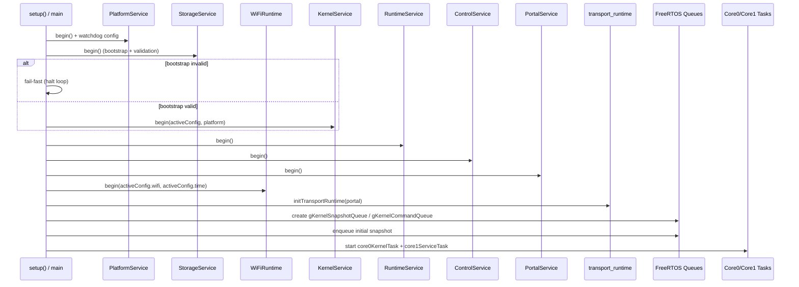
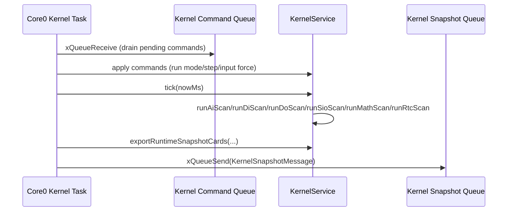
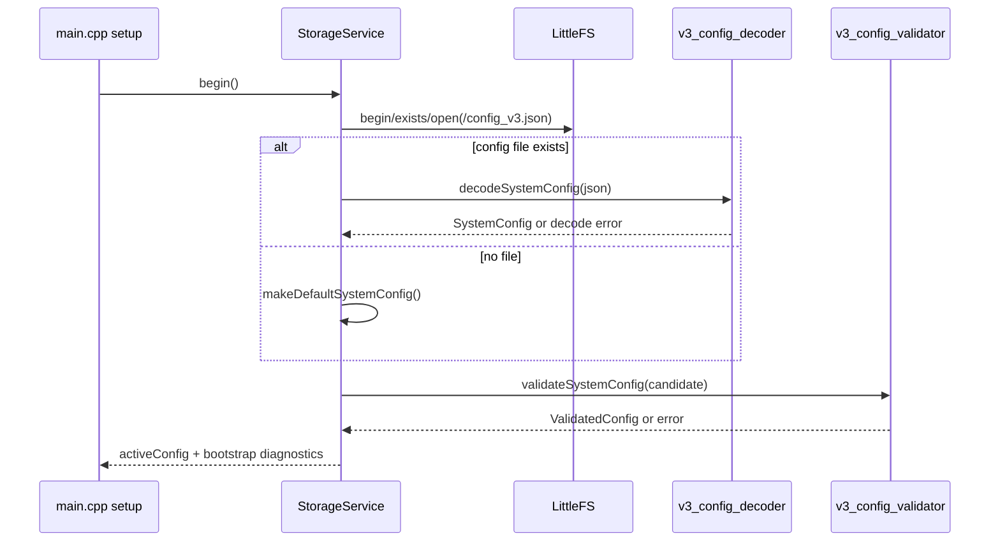
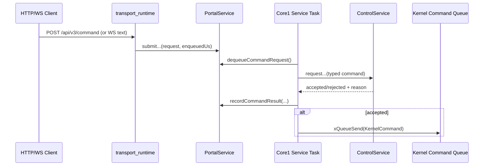
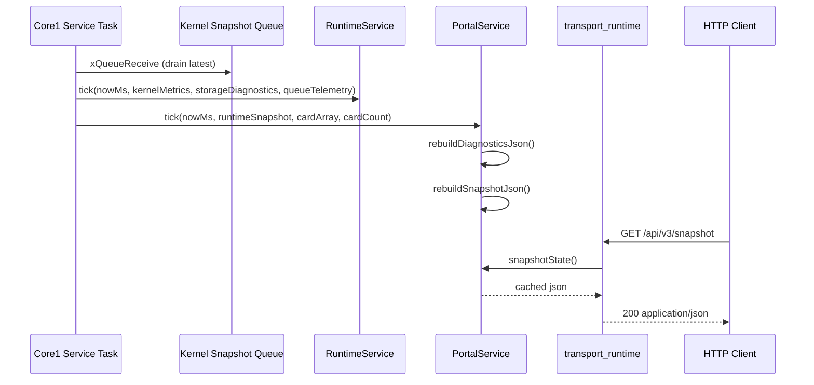

# Architecture (V3)

Date: 2026-03-03  
Status: Active source of truth for runtime architecture and execution flow.

## 1. Purpose

This document defines how the V3 firmware is wired at runtime:

- Which modules own which responsibilities.
- How command and snapshot data move across tasks/queues.
- How a portal request becomes a kernel action and then a snapshot update.
- Sequence-level flow for `kernel`, `storage`, `portal`, and `runtime`.

Primary code anchors:

- `src/main.cpp`
- `src/kernel/kernel_service.*`
- `src/storage/storage_service.*`
- `src/runtime/runtime_service.*`
- `src/portal/portal_service.*`
- `src/portal/transport_runtime.cpp`

## 1.1 How To Read This Document

Recommended order:

1. Read Section 2 (`Runtime Topology`) to understand core ownership and queue boundaries.
2. Read Section 3 (`Request-to-Execution Flow`) for the primary command-to-snapshot path.
3. Read Section 5 (`Sequence Diagrams`) for timing/interaction visualization.
4. Read Section 6 (`Failure Paths`) before changing queue, transport, or config lifecycle behavior.
5. Read Section 7 (`Timing And Latency Budgets`) before changing scan cadence, queue capacities, or command ingestion behavior.

Code entrypoints for fast cross-check:

- Boot/wiring: `src/main.cpp`
- Deterministic scan owner: `src/kernel/kernel_service.cpp`
- Portal ingress/cached JSON: `src/portal/portal_service.cpp`
- Transport HTTP/WS boundary: `src/portal/transport_runtime.cpp`
- Runtime snapshot projection: `src/runtime/runtime_service.cpp`
- Config bootstrap/validation gate: `src/storage/storage_service.cpp`

## 2. Runtime Topology

### 2.1 Core/Task ownership

- Core0 task (`core0KernelTask`): deterministic scan loop (`KernelService::tick`), command application, snapshot card export, enqueue snapshot message.
- Core1 task (`core1ServiceTask`): WiFi/service loop, transport servicing, portal tick, runtime snapshot projection, control/queue dispatch.

### 2.2 Queue boundaries

- `gKernelCommandQueue`: bridges non-deterministic ingress to deterministic kernel control path.
- `gKernelSnapshotQueue`: bridges deterministic kernel outputs to service/portal/runtime consumers.

### 2.3 Service graph (module-level)

- `StorageService` owns config bootstrap (`default` or `LittleFS` file) and validation gate.
- `KernelService` owns scan scheduling, card runtimes, condition evaluation, and per-card runtime state.
- `RuntimeService` owns compact runtime snapshot projection for transport/observability.
- `PortalService` owns command ingress queue and cached JSON for diagnostics/snapshot responses.
- `TransportRuntime` owns HTTP/WebSocket I/O and delegates command parsing/submit to portal.
- `ControlService` validates/queues kernel commands from portal-side requests.
- `PlatformService` owns hardware profile channel mapping (`logical channel -> backend channel`) and hardware IO calls.

### 2.4 Dependency Direction (Allowed Calls)

| From | Allowed To | Why |
| --- | --- | --- |
| `main` | all service modules | Composition root and runtime wiring owner. |
| `transport` | `portal` | Transport is ingress/egress adapter only. |
| `portal` | `control`, `runtime` snapshot view | Portal owns ingress buffering and JSON cache shaping. |
| `control` | kernel command DTO boundary | Control converts requests into validated kernel command intents. |
| `kernel` | runtime primitives, platform time, storage contract types | Deterministic scan owner; no network/storage side effects during scan. |
| `runtime` | kernel metrics + storage diagnostics inputs | Runtime snapshot projection layer only. |
| `storage` | decoder/validator/filesystem | Config lifecycle gate and persistence owner. |

Disallowed direction examples:

- `kernel -> portal` direct coupling.
- `kernel -> transport` direct coupling.
- `transport -> kernel` direct state mutation (must go through portal/control/queue path).
- `portal -> storage` commit-time mutation shortcuts outside storage lifecycle boundary.

## 3. Request-to-Execution Flow

Portal command path (`/api/v3/command` or websocket):

1. `transport_runtime` receives payload and calls `handleTransportCommandStub(...)`.
2. Stub submits typed request into `PortalService` (`submitSetRunMode/submitStepOnce/submitSetInputForce`).
3. Core1 drains portal requests and calls `ControlService::request...`.
4. Core1 dispatches accepted control commands into `gKernelCommandQueue`.
5. Core0 consumes `gKernelCommandQueue` and applies command to `KernelService`.
6. Core0 runs `KernelService::tick(nowMs)` and exports card snapshot entries.
7. Core0 enqueues `KernelSnapshotMessage` into `gKernelSnapshotQueue`.
8. Core1 pulls latest snapshot message, updates `RuntimeService::tick(...)`.
9. Core1 calls `PortalService::tick(...)` to rebuild cached diagnostics/snapshot JSON.
10. Transport endpoints (`/api/v3/snapshot`, `/api/v3/diagnostics`) serve latest cached payload.

## 3.1 Startup And Bring-Up Flow

## 4. Data Contracts Across Boundaries

- Kernel metrics contract: `v3::kernel::KernelMetrics`.
- Runtime snapshot contract: `v3::runtime::RuntimeSnapshot`.
- Per-card snapshot contract: `RuntimeSnapshotCard`.
- Portal cached payload views: `PortalDiagnosticsState`, `PortalSnapshotState`.
- Config contract at bootstrap boundary: `v3::storage::ValidatedConfig`.

## 5. Sequence Diagrams

### 5.1 Kernel scan cycle

Condition-evaluation timing note:

- Clause comparisons that use `useThresholdCard=true` intentionally read referenced `liveValue` in current scan loop order.
- Within-scan order jitter is accepted by design and treated as continuous rotating-loop behavior.

### 5.2 Storage bootstrap

### 5.3 Portal ingress and dispatch

### 5.4 Runtime snapshot projection

## 6. Failure Paths

### 6.1 Command Ingress Backpressure

- Failure mode: portal pending queue full (`PortalService` pending capacity currently `16`).
- Behavior: request is rejected; reject reason is recorded in ingress diagnostics.
- Operational signal: increased `rejectedCount`, queue high-water near capacity.

### 6.2 Cross-Core Kernel Command Queue Saturation

- Failure mode: `gKernelCommandQueue` full (current capacity `16`).
- Behavior: enqueue attempt fails on Core1; drop counter increments.
- Operational signal: `gKernelCommandQueueDropCount` growth and sustained high queue depth.

### 6.3 Snapshot Queue Saturation

- Failure mode: `gKernelSnapshotQueue` full (current capacity `8`).
- Behavior: kernel snapshot enqueue drops oldest/newest opportunity for service side refresh.
- Operational signal: `gKernelSnapshotQueueDropCount` growth and stale portal snapshot cadence.

### 6.4 Storage Bootstrap/Validation Failure

- Failure mode: config file decode or validation fails at startup.
- Behavior: `StorageService` keeps no active config; bootstrap error is exposed through diagnostics.
- Operational signal: non-`None` storage bootstrap error and `hasActiveConfig == false`.

### 6.5 Portal Snapshot/Diagnostics Not Ready

- Failure mode: cached JSON not ready or fallback active (for example during startup or memory-pressure fallback).
- Behavior: transport returns HTTP `503` with not-ready reason.
- Operational signal: endpoint responses with `snapshot_not_ready` or `diagnostics_not_ready`.

### 6.6 Command Rejection Matrix

| Stage | Reject Condition | Surface Signal |
| --- | --- | --- |
| Transport ingress | malformed payload / unsupported command shape | HTTP error body from command stub |
| Portal enqueue | pending queue full | submit result `accepted=false`, ingress reject counters |
| Control validation | invalid mode/card/input-force semantics | command reject reason recorded |
| Kernel queue dispatch | `gKernelCommandQueue` full | queue drop counter increment |
| Kernel apply | command references unsupported card/family path | no-op/ignored apply with diagnostics context |

## 7. Timing And Latency Budgets

Authoritative contract reference:

- `docs/timing-budget-v3.md`

Current implementation targets and guardrails:

- Deterministic scan target (`RUN_NORMAL`): `10 ms` (`scanPeriodMs` target profile).
- Queue capacities: `gKernelCommandQueue = 16`, `gKernelSnapshotQueue = 8`, `PortalService::kPendingCapacity = 16`.
- Core task loop delays: Core0 `1 ms`, Core1 `1 ms`.

Operational budget intent:

- No sustained scan overrun accumulation under nominal local load.
- No sustained queue growth trend for command/snapshot queues.
- Command enqueue-to-apply latency remains bounded and observable in runtime diagnostics.
- Snapshot publish cadence stays aligned with scan cadence without persistent queue drops.

When changing queue capacities, scan period, or transport command rate limits:

1. Update this section.
2. Update `docs/timing-budget-v3.md` if contract thresholds change.
3. Re-run stress/soak validation and record evidence.

## 8. Observability Map

| Signal/Counter | Meaning | Typical Triage |
| --- | --- | --- |
| `gKernelCommandQueueDepth` / high-water | command-pressure level crossing core boundary | check ingress burst, control dispatch rate |
| `gKernelCommandQueueDropCount` | deterministic command queue saturation | increase queue capacity or throttle ingress |
| `gKernelSnapshotQueueDepth` / high-water | snapshot handoff pressure | inspect Core1 service loop latency |
| `gKernelSnapshotQueueDropCount` | stale snapshot risk under pressure | inspect Core1 load, payload generation cadence |
| portal ingress `rejectedCount` | portal pending queue overload | inspect transport burst/backpressure policy |
| portal serialize/capacity reject counters | JSON cache memory-pressure behavior | inspect payload size and heap reserve strategy |
| storage bootstrap error + active-config flag | startup config validity outcome | inspect config file decode/validation failure |
| kernel completed scans / last scan timestamp | deterministic engine liveness | inspect run mode, watchdog, queue starvation |

## 9. Architectural Guardrails

- Deterministic runtime work stays on Core0.
- Non-deterministic I/O and service work stays on Core1.
- Cross-core effects go through explicit queues, not direct mutable shared state mutation.
- Storage validation gate must pass before kernel begin.
- Kernel must access DI/DO/AI through `PlatformService` logical-channel APIs, not hardcoded board pin constants.
- Portal responses are cache-backed; do not build large transport payloads directly on hot request path.
- User-facing terms must align with `docs/naming-glossary-v3.md` for payload/UI consistency.

## 10. Change Control

When changing module boundaries, queues, or command/snapshot flow:

1. Update this document in the same PR.
2. Update `docs/decisions.md` if behavior/contracts changed.
3. Update `docs/api-contract-v3.md` and `docs/schema-v3.md` when payload/schema semantics change.
